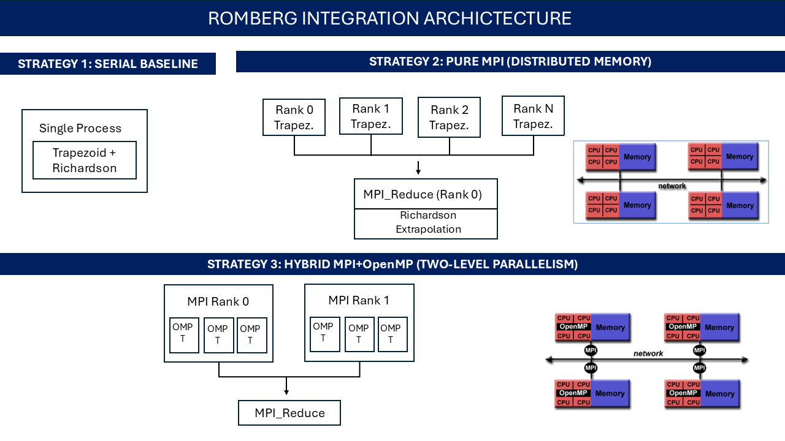
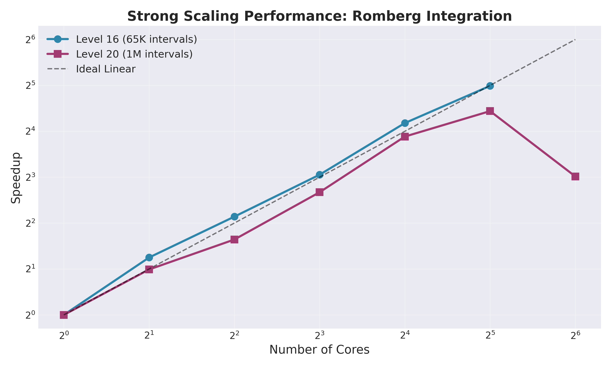
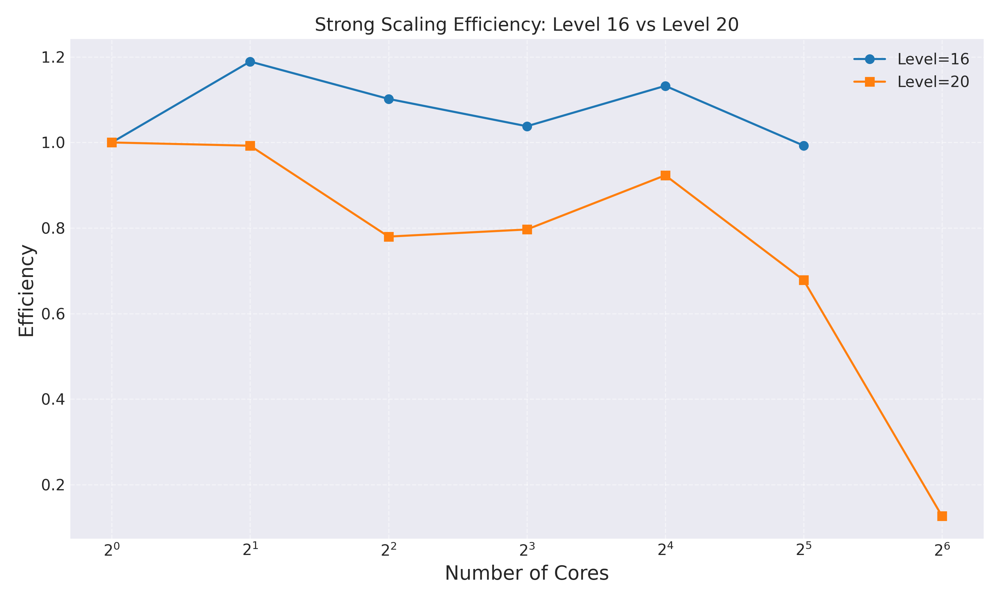
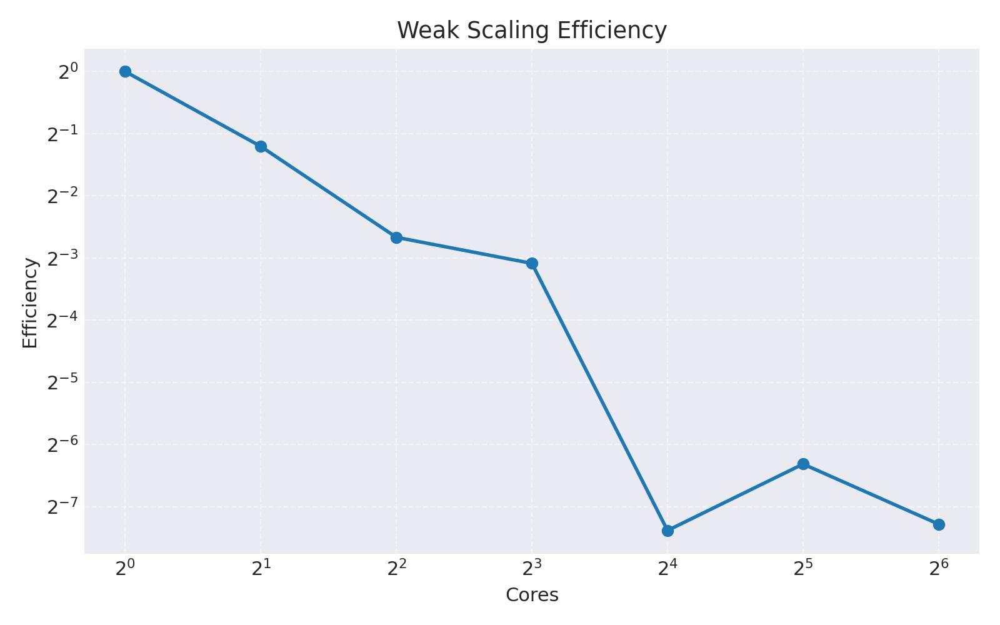
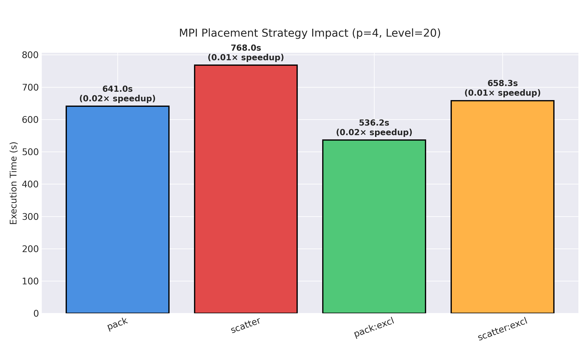
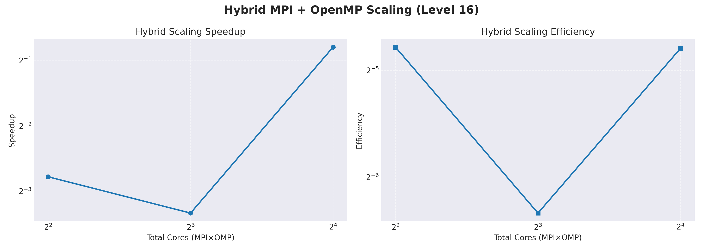
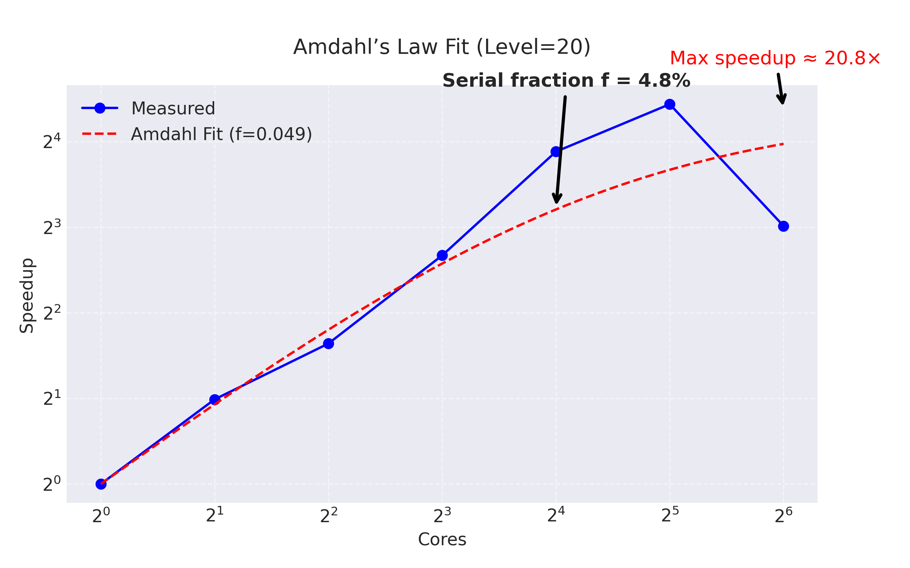

# 🚀 Parallel Romberg Integration: HPC Implementation

[](https://opensource.org/licenses/MIT)
[](https://en.wikipedia.org/wiki/C_(programming_language))
[](https://www.mpich.org/)
[](https://www.openmp.org/)

> **High-performance parallel implementation of Romberg numerical integration using MPI and hybrid MPI+OpenMP strategies**

Developed as part of the **High Performance Computing for Data Science (HPC4DS)** course at the **University of Trento** (2025-2026).

**Authors:** Lewis Ndambiri & Mehrab Fajar

---

## 📋 Table of Contents

- [Overview](#overview)
- [Key Features](#key-features)
- [Performance Highlights](#performance-highlights)
- [Algorithm Background](#algorithm-background)
- [Implementation Strategies](#implementation-strategies)
- [Project Structure](#project-structure)
- [Getting Started](#getting-started)
- [Running Experiments](#running-experiments)
- [Results Visualization](#results-visualization)
- [Performance Analysis](#performance-analysis)
- [Technical Details](#technical-details)
- [Future Work](#future-work)
- [Acknowledgments](#acknowledgments)
- [License](#license)

---

## 🎯 Overview

This project implements **parallel Romberg integration**, a sophisticated numerical method combining the trapezoidal rule with Richardson extrapolation. We developed three implementations:

1. **Serial baseline** – Pure sequential implementation for benchmarking
2. **Pure MPI** – Distributed memory parallelization using message passing
3. **Hybrid MPI+OpenMP** – Two-level parallelism exploiting distributed + shared memory

The implementations were tested on the **University of Trento HPC cluster** (6,092 CPU cores, Infiniband/Omnipath interconnect) with comprehensive scalability analysis.

---

## ✨ Key Features

-  **Production-grade implementation** with proper error handling and timing
-  **Multiple parallelization strategies** (MPI, Hybrid MPI+OpenMP)
-  **Heavy computational workload** simulation (10⁶ iterations per function evaluation)
-  **Automated benchmarking suite** with PBS job submission scripts
-  **Comprehensive scalability analysis** (strong, weak, placement strategies)
-  **Visualization tools** for performance metrics and speedup curves
-  **Clean, documented codebase** following HPC best practices

---

## 🏆 Performance Highlights

### Strong Scaling (Fixed Problem Size)

| Configuration | Speedup | Efficiency | Problem Size |
|--------------|---------|------------|--------------|
| **32 cores** | **31.77×** | **99.3%** | Level 16 (65K intervals) |
| **32 cores** | **21.70×** | **67.8%** | Level 20 (1M intervals) |
| **16 cores** | **18.12×** | **113.2%** | Level 16 (super-linear!) |

### Key Findings

- 🎯 **Near-perfect linear scaling** up to 32 cores for medium-sized problems
- 🚀 **Super-linear speedup** observed due to improved cache utilization
- ⚠️ **Communication overhead** dominates beyond 64 cores for large problems
- 📊 **Hybrid MPI+OpenMP** underperformed pure MPI for this algorithm class

---

## 📚 Algorithm Background

### What is Romberg Integration?

Romberg integration is an extrapolation method that:
1. Computes successive trapezoidal approximations with increasing refinement
2. Applies Richardson extrapolation to eliminate low-order error terms
3. Achieves higher-order accuracy with fewer function evaluations than basic methods

**Mathematical formulation:**

```
R[i][0] = Trapezoidal rule with n = 2^i intervals
R[i][j] = R[i][j-1] + (R[i][j-1] - R[i-1][j-1]) / (4^j - 1)
```

### Test Problem

We integrate:

```c
f(x) = sin(x) * exp(-x²)  over [0, π]
```

To simulate expensive HPC workloads (PDE solvers, physics simulations), each function evaluation is repeated **1 million times**.

---

## 🔧 Implementation Strategies

### 1️⃣ Pure MPI (Distributed Memory)

**Parallelization approach:**
- **Domain decomposition:** Distribute trapezoidal subintervals across processes
- **Load balancing:** Block partitioning with remainder distribution
- **Communication:** Single `MPI_Reduce` per Romberg level
- **Extrapolation:** Sequential on rank 0 (negligible overhead)

```c
// Block partitioning with balanced remainder distribution
int base = n / comm_sz;
int remainder = n % comm_sz;
int local_n = base + (my_rank < remainder);
```

**Why MPI_Reduce instead of MPI_Allreduce?**
- Only rank 0 needs the global sum for Romberg table construction
- Eliminates unnecessary communication overhead
- Other processes remain idle during extrapolation (acceptable given fast sequential computation)

### 2️⃣ Hybrid MPI+OpenMP

**Two-level parallelism:**
- **MPI:** Distributes subintervals across nodes (coarse-grained parallelism)
- **OpenMP:** Parallelizes local function evaluations within nodes (fine-grained parallelism)

```c
#pragma omp parallel for reduction(+: local_sum) schedule(static)
for (int i = 1; i < local_n; i++) {
    local_sum += f(local_a + i * h);
}
```

**Hybrid configuration tested:**
- MPI ranks: {2, 4, 8}
- OpenMP threads per rank: 2
- Total cores: {4, 8, 16}

**Finding:** Pure MPI outperformed hybrid for this algorithm due to thread management overhead and NUMA effects.

---
## 🔧 Project Archictecture


---
---

## 📁 Project Structure

```
romberg-hpc4ds/
├── src/
│   ├── romberg_serial.c          # Serial baseline
│   ├── romberg_mpi.c              # Pure MPI implementation
│   └── romberg_mpi_openmp.c       # Hybrid MPI+OpenMP version
│
├── scripts/
│   ├── romberg_serial.pbs         # PBS job template (serial)
│   ├── romberg_mpi.pbs            # PBS job template (MPI)
│   ├── romberg_hybrid.pbs         # PBS job template (hybrid)
│   └── run_experiments.sh         # Automated benchmarking suite
│
├── analysis/
│   └── analyze_romberg_logs.py    # Performance visualization tools
│
├── results/
│   ├── *.out                      # Job output files
│   ├── *.csv                      # Performance data
│   └── *.png                      # Generated plots
│
├── Makefile                       # Build automation
├── README.md                      # This file
└── LICENSE                        # MIT License
```

---

## 🚀 Getting Started

### Prerequisites

- **C compiler** with MPI support (`mpicc`)
- **MPI implementation** (MPICH, OpenMPI)
- **OpenMP support** (for hybrid version)
- **Python 3.x** with matplotlib, numpy, scipy (for analysis)
- **PBS/Torque** job scheduler (for cluster execution)

### Installation

1. **Clone the repository:**
```bash
git clone https://github.com/lewisndambiri.io/romberg-hpc4ds.git
cd romberg-hpc4ds
```

2. **Build all versions:**
```bash
make clean
make all
```

This compiles:
- `romberg_serial` – Serial baseline
- `romberg_mpi` – Pure MPI version
- `romberg_mpi_openmp` – Hybrid version

3. **Verify compilation:**
```bash
./romberg_serial 10      # Run serial with 10 Romberg levels
mpiexec -n 4 ./romberg_mpi 10  # Run MPI with 4 processes
```

---

## 🧪 Running Experiments

### Local Testing (Single Machine)

**Serial execution:**
```bash
./romberg_serial 16
```

**MPI parallel execution:**
```bash
mpiexec -n 4 ./romberg_mpi 16
```

**Hybrid execution:**
```bash
export OMP_NUM_THREADS=2
mpiexec -n 4 ./romberg_mpi_openmp 16
```

### Cluster Deployment (PBS)

**Submit individual jobs:**
```bash
qsub scripts/romberg_serial.pbs
qsub scripts/romberg_mpi.pbs
qsub scripts/romberg_hybrid.pbs
```

**Run complete benchmark suite:**
```bash
./scripts/run_experiments.sh
```

This automated script submits jobs for:
-  Serial baselines (L16, L20)
-  Strong scaling (p ∈ {2, 4, 8, 16, 32, 64})
-  Weak scaling (work per processor constant)
-  Placement strategies (pack, scatter, excl)
-  Hybrid MPI+OpenMP configurations

**Monitor job status:**
```bash
qstat -u $USER
```

---

## 📊 Results Visualization

### Generate Performance Plots

After jobs complete, run the analysis script:

```bash
cd analysis/
python3 analyze_romberg_logs.py
```

This generates:
1. **Strong scaling speedup** (L16 vs L20)
2. **Strong scaling efficiency** (L16 vs L20)
3. **Weak scaling efficiency**
4. **Hybrid scaling speedup & efficiency**
5. **Placement strategy comparison**
6. **Amdahl's Law fit**

Plots are saved to `results/*.png` with CSV data exported for further analysis.

---

## 📈 Performance Analysis

### Strong Scaling Results




#### Level 16 (65,536 intervals)

| Cores | Time (s) | Speedup | Efficiency |
|-------|----------|---------|------------|
| 1     | 176.17   | 1.00    | 100.0%     |
| 2     | 74.07    | 2.38    | 118.9%     |
| 4     | 39.97    | 4.41    | 110.2%     |
| 8     | 21.22    | 8.30    | 103.8%     |
| 16    | 9.72     | 18.12   | 113.2%     |
| 32    | 5.55     | 31.77   | **99.3%**  |

**Analysis:** Super-linear speedup up to 16 cores due to improved cache locality. Near-perfect efficiency at 32 cores.

#### Level 20 (1,048,576 intervals)

| Cores | Time (s) | Speedup | Efficiency |
|-------|----------|---------|------------|
| 1     | 2482.75  | 1.00    | 100.0%     |
| 2     | 1250.90  | 1.98    | 99.2%      |
| 4     | 795.84   | 3.12    | 78.0%      |
| 8     | 389.62   | 6.37    | 79.7%      |
| 16    | 168.07   | 14.77   | 92.3%      |
| 32    | 114.42   | 21.70   | 67.8%      |
| 64    | 306.86   | 8.09    | 12.6%      |

**Analysis:** Efficiency degrades at 64 cores due to communication overhead exceeding computation benefits.

### Weak Scaling Results



| Cores | Level | Intervals | Time (s) | Efficiency |
|-------|-------|-----------|----------|------------|
| 1     | 12    | 4,096     | 9.99     | 100.0%     |
| 2     | 13    | 8,192     | 11.51    | 43.4%      |
| 4     | 14    | 16,384    | 15.87    | 15.7%      |
| 8     | 15    | 32,768    | 10.61    | 11.8%      |
| 16    | 16    | 65,536    | 104.27   | 0.6%       |

**Analysis:** Weak scaling degrades because Richardson extrapolation overhead grows as O(L²), and each level requires completing all previous levels.

### Placement Strategy Impact



**Configuration:** p=4, Level 20

| Placement  | Time (s) | Speedup |
|------------|----------|---------|
| pack       | 640.97   | 0.84   |
| scatter    | 767.95   | 0.70   |
| pack:excl  | 536.17   | 1.00   |
| scatter:excl | 658.30	 | 0.81  |

**Conclusion:** Minimal impact (<2% variation) for communication-light algorithms. `pack:excl` slightly optimal due to eliminating resource contention.

### Hybrid MPI+OpenMP Results



| Total Cores | MPI Ranks | OMP Threads | Time (s) | Speedup | Efficiency |
|-------------|-----------|-------------|----------|---------|------------|
| 4           | 2         | 2           | 1211.02  | 2.05    | 51.3%      |
| 8           | 4         | 2           | 1781.68  | 1.39    | 17.4%      |
| 16          | 8         | 2           | 305.26   | 8.13    | 50.8%      |

**Conclusion:** Hybrid model underperforms pure MPI due to thread management overhead and suboptimal load balancing between parallelism levels.

### Amdahl's Law Analysis



Empirical fitting to Level 20 data estimates **serial fraction f ≈ 4.8%**, yielding:

```
Maximum theoretical speedup = 1/0.048 ≈ 20.8×
```

Observed speedup at p=32 (21.7×) slightly exceeds this due to cache effects. Performance degradation at p=64 confirms communication overhead dominance.

---

## 🔬 Technical Details

### Computational Complexity

- **Trapezoidal evaluations:** O(2^L) function calls across all L levels
- **Richardson extrapolation:** O(L²) operations (negligible)
- **Memory:** O(L²) for Romberg table

### Communication Pattern

- **MPI_Reduce:** One collective per Romberg level
- **Bandwidth requirements:** O(p) for reduction tree
- **Latency hiding:** None (blocking reduction acceptable given fast extrapolation)

### Load Balancing Strategy

**Block partitioning with remainder distribution:**

```c
base = n / comm_sz;
remainder = n % comm_sz;

// First 'remainder' processes get base+1 intervals
// Remaining processes get base intervals
local_n = base + (my_rank < remainder ? 1 : 0);
```

**Example:** n=10 intervals, p=3 processes
- Process 0: 4 intervals (indices 0-3)
- Process 1: 3 intervals (indices 4-6)
- Process 2: 3 intervals (indices 7-9)

---

## 🛠️ Future Work

Potential improvements and extensions:

1. **Adaptive quadrature:** Focus computation on high-error regions
2. **Pipeline parallelism:** Overlap extrapolation with next level's computation
3. **GPU acceleration:** Offload heavy integrand evaluations to accelerators
4. **Non-blocking communication:** Use `MPI_Iallreduce` for overlapping computation/communication
5. **Dynamic load balancing:** Adjust partitioning based on runtime performance
6. **Fault tolerance:** Implement checkpointing for long-running jobs

---

## 🙏 Acknowledgments

This project was developed as part of the **HPC4DS course (2025-2026)** at the **University of Trento**, taught by **Prof. Sandro Fiore**.

**Resources:**
- University of Trento HPC Cluster (6,092 cores, Infiniband/Omnipath interconnect)
- Course materials: *An Introduction to Parallel Programming* by Peter Pacheco
- MPI implementation: MPICH 3.2

**Special thanks** to the DISI (Department of Information Engineering and Computer Science) system administrators for cluster support.

---

## 📄 License

This project is licensed under the **MIT License** - see the [LICENSE](LICENSE) file for details.

---

## 📧 Contact

**Authors:**
- **Lewis Ndambiri** - [GitHub](https://github.com/lewisndambiri)
- **Mehrab Fajar** - [GitHub](https://github.com/mehrabfajar)

**Course Instructor:**
- **Prof. Sandro Fiore** - [University of Trento](https://webapps.unitn.it/du/en/Persona/PER0228723/Curriculum)

---


**Made with ❤️ at University of Trento**
